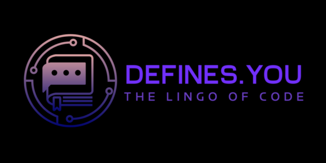

# Programming Jargon Dictionary App for PC

In collabaration with [Harmony Madisha](https://github.com/HarmonyWM) | [Sierra Msiza](https://github.com/sierra445) | [Thero Thethe](https://github.com/thero-sgit)

## Index

- [Summary](#summary)
- [Planning](#planning)
	+ [What We Aims to Achieve](what-we-aims-to-achieve)

## Summary

New developers often struggle with programming terminology. This app serves as a beginner-friendly tool, offering clear and concise definitions of programming terms, making it easier for beginners to understand and technical jargon.

## Project Vision

### 
 What We Aims to Achieve 

Many beginners feel lost when they hear words like "polymorphism," "asynchronous," or "algorithms." 😬

We aim to create a simple solution: a lookup tool that helps them understand these terms, accessible anywhere, including offline.

The app maintains a local dictionary of common programming terms. If a user searches for a term that isn’t available, the app will fetch it from an online dictionary, store it for future use, and to keep things lightweight, the words are saved in two separate files:

- One for pre-loaded common programming terms.
- One for words the user has viewed (cached).